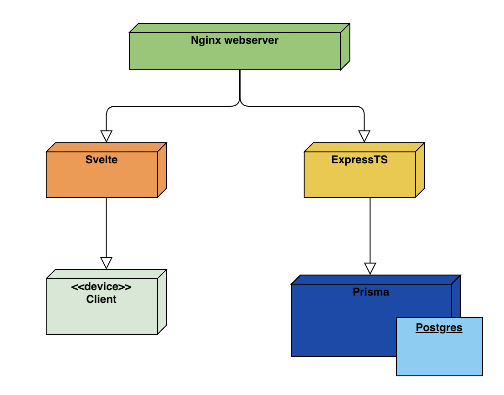
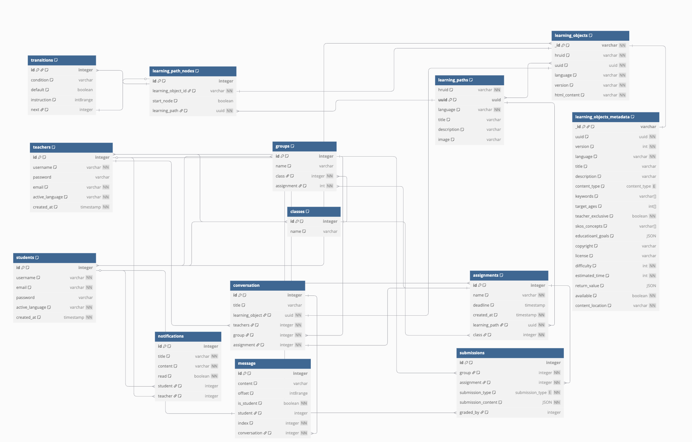

# Dwengo-5

# Installatie-instructies

## Uitvoeren hele applicatie

**Prerequisites:** Er is vereist dat docker reeds geïnstalleerd is op het systeem waarop je alles uitvoert

**Uitvoeren:** Uitvoeren van de applicatie kan met het volgende commando:

```
docker compose -f docker-compose.yml up --build
```

Dit commando zorgt dat alles wordt opgestart en dat de databank wordt gevuld met voorbeelddata.

Alles is beschikbaar op [localhost](http://localhost) door het gebruik van een nginx container. Mocht u al een applicatie draaiende hebben op deze poort is het aangeraden om deze uit te schakelen of [docker-compose.yml](./docker-compose.yml) aan te passen:
```yml
  nginx:
    image: nginx:latest
    container_name: nginx
    ports:
      - "X:80" # aan te passen lijn, X het poortnummer dat u wenst
    volumes:
      - ./docker/nginx/nginx.conf:/etc/nginx/nginx.conf:ro
    depends_on:
      - backend
      - frontend
```

## Uivoeren van de tests

Het uitvoeren van de tests gebeurt aan de hand van een script:
```sh
cd ./src/backend/backend_opzet/
./uitvoeren_tests.sh
```

> [!IMPORTANT]
> Het is belangrijk dat je eerst naar de correcte map gaat want er wordt gebruik gemaakt relatieve bestandspaden, het zou anders dus kunnen dat er iets foutloopt

Vervolgens kan je een test selecteren en dan worden de correcte tests uitgevoerd binnen een docker container



